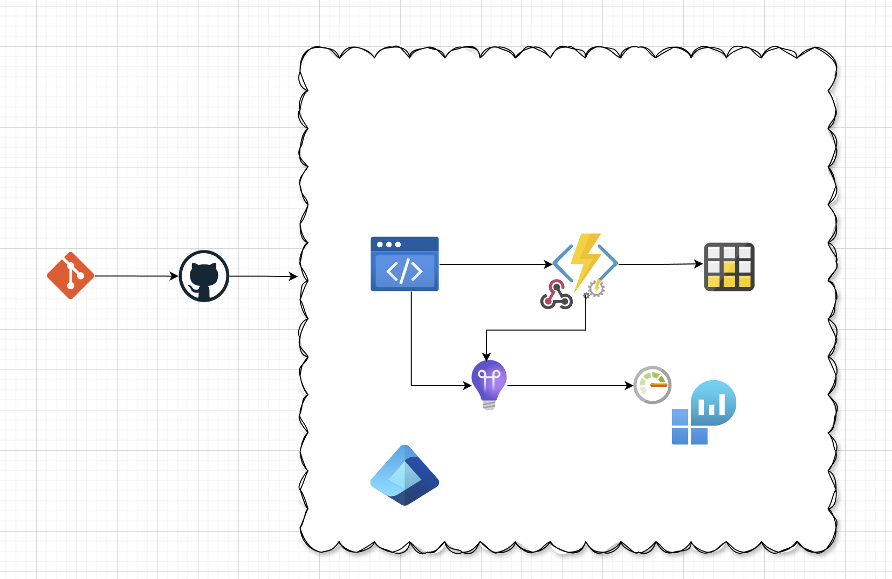

# Yashints tiny url solution
This repository is [my custom Url shortener](https://yas.fyi) solution which uses:

* [Reactjs](https://react.dev/) for frontend
* [Nodejs and Azure functions](https://learn.microsoft.com/en-us/azure/developer/javascript/how-to/develop-serverless-apps?tabs=v4-ts) for the backend
* [Azure Bicep](https://learn.microsoft.com/en-us/azure/azure-resource-manager/bicep/overview?tabs=bicep) to get the resources deployed to Azure
* [GitHub Actions](https://github.com/features/actions) for automatic deployments

## Architecture
Below items are used in Azure to host the app:

* [Azure Static Web Apps](https://learn.microsoft.com/en-us/azure/static-web-apps/overview) to host the frontend
* [Azure Functions](https://learn.microsoft.com/en-us/azure/azure-functions/functions-overview) serverless for the backend
* [Table storage](https://learn.microsoft.com/en-us/azure/storage/tables/table-storage-overview) to keep the records
* [Entra ID](https://www.microsoft.com/en-au/security/business/identity-access/microsoft-entra-id) for authentication
* [Application Insights](https://learn.microsoft.com/en-us/azure/azure-monitor/app/app-insights-overview) for monitoring the apps
* [Log Analytics](https://learn.microsoft.com/en-us/azure/azure-monitor/logs/log-analytics-workspace-overview) workspace for logs

## Software architecture

### Frontend
For frontend I've used a basic create-react-app based application and it has a few components to handle the listing and creation of URLs.

### API
As for the APIs, I've used a few HTTP triggered functions to create, list and delete URLs, and a timer trigger function which pulls data from the log analytics workspace to update the page views for each route.

## Monthly cost

The total cost of hosting the app:

| Service | Tier | Cost |
| ------ | ------ | ------ |
| Static web apps | Standard | $9 |
| Azure Functions | Consumption | $0 for 1M requests per month |
| Azure Monitor | Basic | $0 for 5GB ingestion |
| Azure Table Storage | Standard | $0.5 for 1GB and 100K transactions |
|     | Total |  $9.05 |
